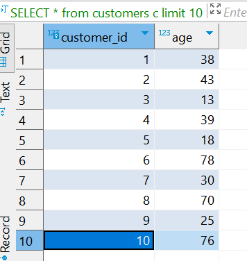
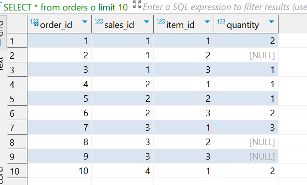
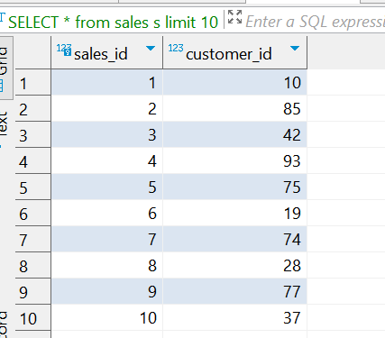
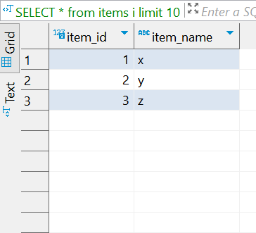

<h1>Smart Database Assistant:</h1>

Want to get information from a database without writing SQL? This video demonstrates a chatbot that can understand your questions and convert them into SQL queries.

Talk to this AI assistant about your database! It understands natural language and automatically generates SQL queries to retrieve the data you need and presents the results in a clear table format.
_Just chat with it, and it will do the searching for you._

https://github.com/devang1218/TEXT_TO_SQL/assets/46046916/912843f1-ceeb-43de-8f9c-7428badd849f

<h1>Tables in database:</h1>

<h2>Customers Table</h2>

<h2>Orders Table</h2>

<h2>Sales Table</h2>

<h2>Items Table</h2>

